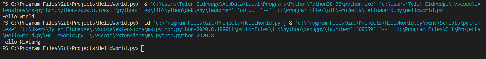

# Overview

This program will say hello to Rexburg. It demonstrates the use of Python with Visual Studio Code and Studio.

# Development Environment

* Visual Studio Code
* Python 3.8.5

# Execution

To execute the program: `python HelloWorld.py`

# Useful Websites

* [Python Refrence](https://docs.python.org/3/library/index.html)